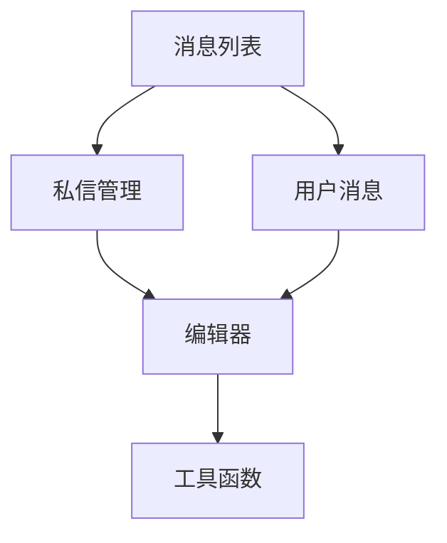

# Fanflow 架构文档

## 项目概述
Fanflow 是一个基于浏览器的扩展应用，主要用于增强用户在 Fanfou（饭否）平台上的交互体验。项目包含多个功能模块，如消息列表、私信管理、用户信息展示等。

## 技术栈
- **前端**: 原生 JavaScript、jQuery
- **存储**: Web Storage API (localStorage/sessionStorage)
- **工具库**: jQuery 3.7.1、Toastr、NProgress

## 核心模块

### 1. 消息列表 (`messagelist.js`)
- **功能**: 展示用户的消息列表，支持消息的增删改查。
- **关键方法**:
  - `buildHomePage`: 构建首页消息列表。
  - `bindMsgAction`: 绑定消息操作事件（如点赞、回复等）。

### 2. 私信管理 (`dmlist.js`)
- **功能**: 管理用户的私信会话，支持会话列表和消息详情展示。
- **关键方法**:
  - `buildDMListPage`: 构建私信列表。
  - `renderConversation`: 渲染私信会话详情。

### 3. 用户消息 (`usermsglist.js`)
- **功能**: 展示用户的消息动态，支持关注/取消关注操作。
- **关键方法**:
  - `buildUserListPage`: 构建用户消息列表。
  - `userListUpdate`: 更新用户列表数据。

### 4. 编辑器 (`editor.js`)
- **功能**: 提供消息编辑和图片上传功能。
- **关键方法**:
  - 图片上传逻辑：支持拖拽上传和预览。

### 5. 工具函数 (`utils.js`)
- **功能**: 提供通用工具方法，如防抖、时间格式化等。
- **关键方法**:
  - `debounce`: 防抖函数。
  - `convertToLocalTime`: 时间格式化。

## 架构图

## 后续优化建议
1. **模块化**: 将功能模块进一步拆分为独立的组件，便于维护。
2. **状态管理**: 引入轻量级状态管理工具，避免全局变量污染。
3. **性能优化**: 减少 DOM 操作，使用虚拟列表优化长列表渲染。

## TODO
- 后台消息检查与badge显示
- 好友增加删除
