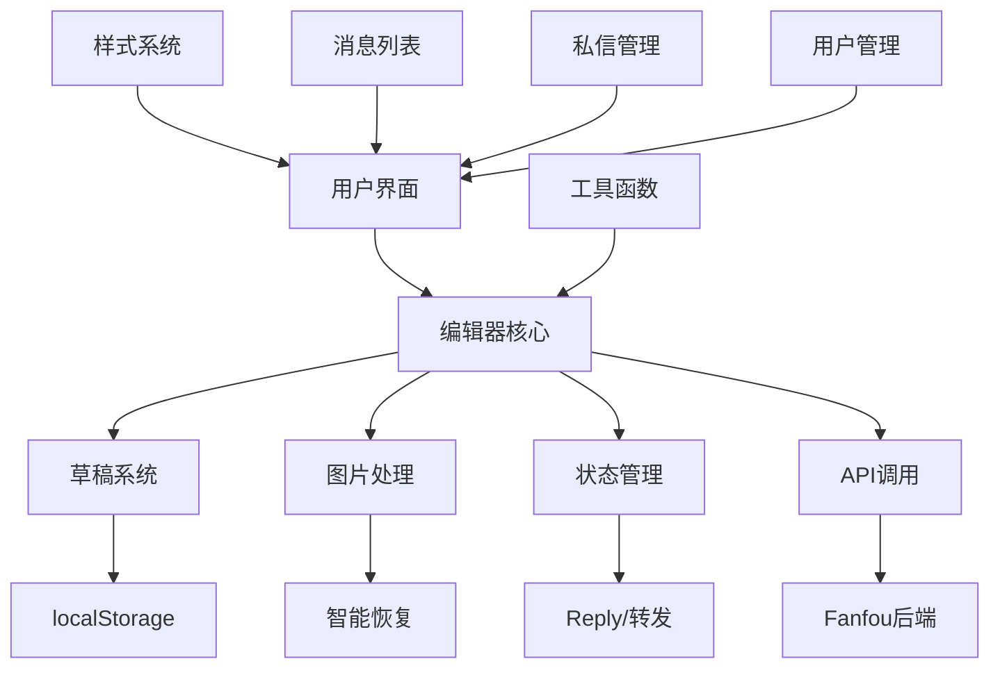

# Fanflow 架构文档

## 项目概述
Fanflow 是一个基于浏览器的扩展应用，主要用于增强用户在 Fanfou（饭否）平台上的交互体验。项目提供了现代化的消息编辑、图片上传、草稿保存等核心功能，以及消息列表、私信管理、用户信息展示等辅助功能。

## 技术栈
- **前端**: 原生 JavaScript (ES6+)、jQuery 3.7.1
- **样式**: SCSS预处理器，现代化CSS设计
- **存储**: Web Storage API (localStorage)，支持草稿持久化
- **工具库**: jQuery、Toastr（通知）、NProgress（进度条）
- **API集成**: Fanfou OAuth1.0认证，RESTful API调用

## 核心模块架构

### 1. 编辑器模块 (`editor.js`) - 核心功能
**主要功能**：
- 现代化消息编辑界面
- 智能草稿保存与恢复系统  
- 图片上传与预览功能
- Reply/转发信息管理
- 字符计数与长度限制

**关键特性**：
- **草稿持久化**: 自动保存编辑内容、图片信息、回复状态
- **智能恢复**: 重新打开时自动尝试恢复图片和状态
- **存储优化**: 轻量化存储策略，避免localStorage限制
- **状态管理**: 完整的回复/转发信息保存与清理
- **错误处理**: 完善的异常捕获和降级机制

**核心方法**：
```javascript
buildPopEditor(type, content)     // 构建编辑器界面
saveEditorState()                 // 保存草稿状态
clearEditorState()               // 清理草稿数据  
智能图片恢复机制                   // 自动恢复用户图片
```

### 2. 样式系统 (`css/editor.scss`) - 现代化设计
**设计理念**：
- 极简设计语言，直角边框风格
- 紧凑的信息布局和字体设计
- 响应式设计，适配不同屏幕尺寸
- 现代化色彩系统和交互反馈

**核心特性**：
- 无圆角设计，简洁专业
- 图片信息右侧布局，空间利用最优化
- 智能删除按钮，悬停显示
- 8px边距设计，视觉呼吸空间

### 3. 消息列表 (`messagelist.js`)
**功能**: 展示用户的消息列表，支持消息的增删改查
**关键方法**:
- `buildHomePage`: 构建首页消息列表
- `bindMsgAction`: 绑定消息操作事件（点赞、回复、转发等）

### 4. 私信管理 (`dmlist.js`) 
**功能**: 管理用户的私信会话，支持会话列表和消息详情展示
**关键方法**:
- `buildDMListPage`: 构建私信列表
- `renderConversation`: 渲染私信会话详情

### 5. 用户消息 (`usermsglist.js`)
**功能**: 展示用户的消息动态，支持关注/取消关注操作
**关键方法**:
- `buildUserListPage`: 构建用户消息列表  
- `userListUpdate`: 更新用户列表数据

### 6. 认证模块 (`fanfou/`)
**功能**: 处理Fanfou平台的OAuth认证和API调用
**包含文件**:
- `fanfou.js`: 核心API调用封装
- `oauth1.js`: OAuth1.0认证实现
- `cred.js`: 认证凭据管理

### 7. 工具函数 (`utils.js`)
**功能**: 提供通用工具方法
**关键方法**:
- `debounce`: 防抖函数，优化性能
- `convertToLocalTime`: 时间格式化
- 各种DOM操作和数据处理辅助函数

## 数据流架构

### 草稿数据结构
```javascript
{
    text: "用户输入的文本内容",
    hasImage: true/false,
    timestamp: Date.now(),
    replyInfo: {
        in_reply_user_id: "回复用户ID",
        in_reply_msg_id: "回复消息ID", 
        in_repost_user_id: "转发用户ID",
        in_repost_msg_id: "转发消息ID"
    },
    imageData: {
        name: "文件名",
        size: 文件大小,
        type: "image/jpeg",
        lastModified: 时间戳,
        imageSrc: "图片URL"  // 轻量化存储，不保存Base64
    }
}
```

### 存储策略
- **优先级**: 文本内容 > Reply信息 > 图片基本信息 > 其他数据
- **存储限制**: 避免超出localStorage 5-10MB限制
- **数据清理**: 智能清理机制，文本/图片清空时自动清理相关状态

## 架构设计图



## 关键设计决策

### 1. 草稿系统设计
- **自动保存**: 1秒防抖保存，避免频繁写入
- **智能恢复**: 优先尝试直接恢复，失败时提示重新选择  
- **轻量存储**: 图片不保存Base64，只保存URL和基本信息
- **状态同步**: 文本变化时自动清理reply信息

### 2. 图片处理策略
- **预览机制**: 使用URL.createObjectURL生成预览
- **删除功能**: 悬停显示删除按钮，一键删除
- **恢复策略**: fetch验证文件完整性，重建File对象
- **错误处理**: 多层降级，确保功能可用性

### 3. 用户体验设计
- **视觉一致**: 统一的直角设计语言
- **交互反馈**: 现代化动画和状态提示
- **空间布局**: 图片右侧信息展示，充分利用空间
- **响应式**: 移动端优化的紧凑设计

## 性能优化策略

### 1. 存储优化
- 轻量化数据结构，避免大文件存储
- 智能清理机制，及时删除无用数据  
- 防抖保存，减少频繁写入操作

### 2. 渲染优化
- CSS动画替代JavaScript动画
- 事件委托减少事件绑定
- DOM操作批量处理

### 3. 网络优化
- 图片预览使用本地URL
- API调用错误重试机制
- 智能的文件上传验证

## 错误处理机制

### 1. 存储错误
- QuotaExceededError: 降级保存策略
- 数据损坏: 清理重置机制
- 读取失败: 优雅降级

### 2. 网络错误  
- API调用失败: 用户友好提示
- 图片上传失败: 重试和状态反馈
- 认证过期: 自动重新认证

### 3. 界面错误
- DOM操作异常: 防御式编程
- 事件处理错误: 异常捕获和恢复
- 状态不一致: 自动同步机制

## 未来优化方向

### 1. 技术升级
- 考虑引入现代化框架（Vue/React）
- 实现真正的组件化架构
- 添加TypeScript类型安全

### 2. 功能增强
- 更丰富的编辑功能（Markdown支持、表情包等）
- 批量操作和快捷键支持
- 离线功能和后台同步

### 3. 性能提升
- 虚拟滚动优化长列表
- Web Worker处理大文件
- Service Worker缓存策略

## 维护指南

### 1. 代码规范
- ES6+语法，保持现代化
- 完整的错误处理
- 详细的注释和文档

### 2. 测试策略
- 草稿保存/恢复功能测试
- 图片上传/删除操作测试
- 边界条件和异常场景测试

### 3. 部署考虑
- localStorage兼容性检查
- CSS编译和压缩
- JavaScript代码压缩和混淆

这个架构支持了一个功能完整、用户体验优秀的现代化编辑器系统，具有良好的扩展性和维护性。
